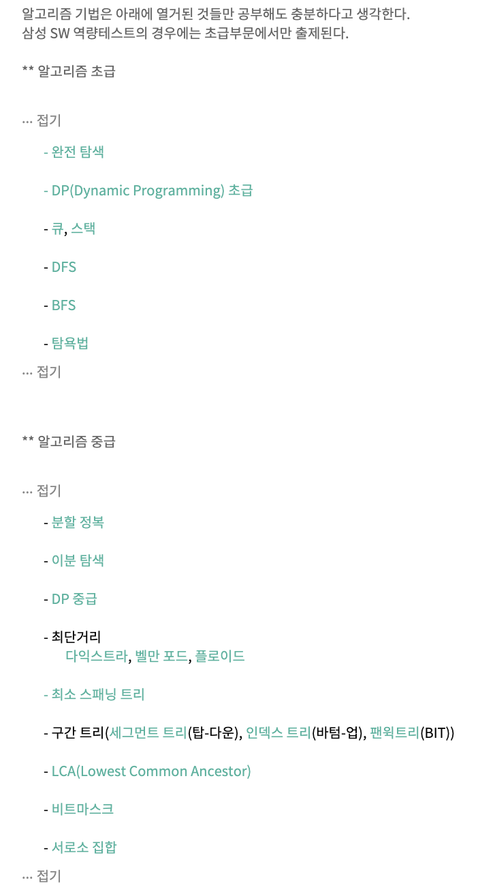

# 0. SW 역량 테스트

### 1. SW 역량 테스트 정보

[https://stack.news/2019/09/23/sw-%EC%97%AD%EB%9F%89-%ED%85%8C%EC%8A%A4%ED%8A%B8-%EB%AC%B8%EC%A0%9C-%EB%B6%84%EC%84%9D/](https://stack.news/2019/09/23/sw-역량-테스트-문제-분석/)


### 2. Algorithm List




### 3. Python으로 문제 풀 때 주의해야할 점

##### 1. input() 말고 sys.stdin.readline() 를 사용하자.

결론만 말하자면, 입출력 속도가 다음과 같다.

> **sys.stdin.readline()** > **raw_input()** > **input()**

뭐 어느정도로 더 빠르고 느리냐는, 코딩 테스트 문제푸는 수준에서 다룰만한 내용이 아니므로 넘어가도록 하고, 직관적으로만 느꼈던 것은, **input()** 으로 코드를 제출할 시, 시간초과가 뜨지만, **sys.stdin.readline()** 으로 제출할 시 정답이 뜨더라는 것이다. 이와 비슷한 이슈는 이미 이전부터 있었다.

- 참고 링크 : https://www.acmicpc.net/board/view/19327

한편, 나는 입출력을 지금까지 이런 방식으로 했다.

```
a = [int(x) for x in input().split()]  
# a = [1, 2, 3, 4 ,5]
```

하지만, 이 방법보다 다음 방법이 더 권장된다. (위와 같은 이유로)

```
import sys  
a = map(int, sys.stdin.readline())  
# a = [1, 2, 3, 4, 5]
```

여러 라인 입력받아야 할 경우, 다음 방법이 빠르다고 한다.

```
import sys  
n = input()  
a = [sys.stdin.readline() for i in range(n)]  
# a = ["1 2 3", "4 5 6"]
```


##### 2. 재귀함수가 있는 경우, 최대 재귀 깊이를 설정해줘야 한다.

이전에 문제풀다가 말한 적이 있는데, 특히 자주접하는 DFS, BFS 문제의 경우 그렇다.

파이썬의 재귀 허용 깊이의 기본치가 c 보다 약한건지, c 로 짠 DFS, BFS의 경우 문제 없이 돌아가지만, 파이썬으로 돌리면 런타임 오류가 뜨는 경우가 있다. 그래서 다음과 같이 재귀 허용 깊이를 수동으로 늘려주는 코드를, 코드 상단에 적어줘야 한다.

```
import sys  
sys.setrecursionlimit(10**8) # 10^8 까지 늘림
```


##### 3. PyPy vs Python3

이렇게 해도 정답이 아니라고 뜨는 경우가 있는데, 이 때 파이썬3가 아니라 PyPy로 언어를 바꿔 제출하면 된다.

PyPy 가 뭔지 찾아보니, 쉽게말해 파이썬 보다 몇 배 더 빠른 개선된 파이썬이라고 생각하면 된다.

좀 더 자세히 말하면, Python3 는 내부적으로는 C로 짜여져있는데 (이 이유 때문에 Python2 보다 빠르다.), 이를 C가 아니라 Python으로 다시 짠 것이다. 당연히 느릴 것 같은데, 의외로 빠르단다. 자세한 내용은 [나무위키](https://namu.wiki/w/PyPy) 참고.

때문에, 일반적으로 Python3 보다 PyPy로 제출해서 내는게 더 안전한 듯 하다. (빠르다는 의미에서)

한편, PyPy에서는 `sys.setrecursionlimit(10**8)` 이 안먹는다. 즉 임의로 재귀 호출 깊이를 설정할 수 없다는 것에 주의해야 한다.


출처: https://dailyheumsi.tistory.com/32 [하나씩 점을 찍어 나가며]


# 1. 이건 무조건 풀고 가야해

- https://swexpertacademy.com/main/userpage/code/userProblemBoxDetail.do?probBoxId=AV5Po0AqAPwDFAUq&leftPage=1&curPage=userpage&userId=SWEAC 
- https://www.acmicpc.net/workbook/view/1152


# 2. 이것도 도전해야해 

- https://www.acmicpc.net/workbook/view/2771 

- https://rebas.kr/789


# 3. 연습해야해

### 1. 시뮬레이션

- https://www.acmicpc.net/problem/2933 
- https://www.acmicpc.net/problem/11559 
- https://www.acmicpc.net/problem/3568 
- https://www.acmicpc.net/problem/2290 
- https://www.acmicpc.net/problem/16113 
- https://www.acmicpc.net/problem/15898 
- https://www.acmicpc.net/problem/15778 
- https://www.acmicpc.net/problem/1194 
- https://www.acmicpc.net/problem/3197 
- https://www.acmicpc.net/problem/6987 
- https://www.acmicpc.net/problem/8911 
- https://www.acmicpc.net/problem/16506

### 2. 추가 연습

- https://www.acmicpc.net/problem/9663 
- https://www.acmicpc.net/problem/2573 
- https://www.acmicpc.net/problem/1261 
- https://www.acmicpc.net/problem/3184 
- https://www.acmicpc.net/problem/10711 
- https://www.acmicpc.net/problem/14620 
- https://www.acmicpc.net/problem/4179 
- https://www.acmicpc.net/problem/3055 
- https://www.acmicpc.net/problem/1799 
- https://www.acmicpc.net/problem/9376 
- https://www.acmicpc.net/problem/14442 
- https://www.acmicpc.net/problem/2422 
- https://www.acmicpc.net/problem/2933 
- https://www.acmicpc.net/problem/16198 
- https://www.acmicpc.net/problem/16197 
- https://www.acmicpc.net/problem/3019 
- https://www.acmicpc.net/problem/2916 
- https://www.acmicpc.net/problem/3197 
- https://www.acmicpc.net/problem/12906


