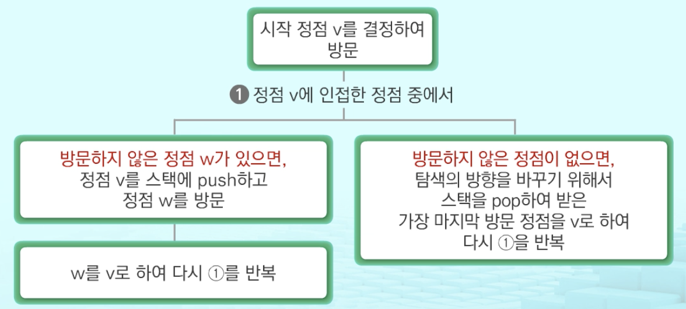

# DFS

비선형구조인 그래프 구조는 그래프로 표현된 모든 자료를 빠짐없이 검색하는 것이 중요함

| 깊이 우선 탐색(Depth First Search, DFS) | 너비 우선 탐색(Breadth First Search, BFS) |
| :-------------------------------------: | :---------------------------------------: |
|                  stack                  |                   queue                   |

### DFS(깊이 우선 탐색)

- 방법

  1. 시작 정점의 한 방향으로 갈 수 있는 경로가 있는 곳까지 깊이 탐색함
  2. 더 이상 갈 곳이 없게 되면, 가장 마지막에 만났던 갈림길 간선이 있는 정점으로 되돌아옴
  3. 다른 방향의 정점으로 탐색을 계속 반복하여 결국 모든 정점을 방문하여 순회함

  *가장 마지막에 만났던 갈림길의 정점으로 되돌아가서 다시 깊이 우선 탐색을 반복해야 하므로 **후입선출 구조의 스택**을 사용함*



*stack이 공백이 될 때까지 반복함*

```python
visited[], stack[] 초기화
DFS(v):
  v 방문;
  visted[v] <- true;
  do {
    if(v의 인접 정점 중 방문 안 한 w 찾기)
    	push(v);
    while(w){
      w 방문;
      visited[w] <- true;
      push(w);
      v <- w;
      v의 인접 정점 중 방문 안 한 w찾기
    }
    v <- pop(stack)
  }while(v)
end DFS()
```

