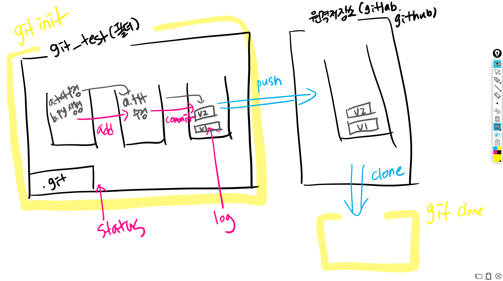

# GIT

> 분산 버전관리시스템(DVCS)


- GUI v.s. CLI

  - GUI: Graphic User Interface
  - CLI: Command Line Interface

  

| working tree directory |   staging area    | 커밋 이력 |
| :--------------------: | :---------------: | :-------: |
|       작업 공간        |  커밋을 할 대상   |           |
| a.txt - (git add .) -> | - (git commit) -> |   ver 1   |

> - a.txt가 저장되는 게 아니라 version이 저장되는 것임
>
> - 확인
>
>   - 전체 상태 -> git status
>   
>   - 커밋 이력 -> git log


## 기초 명령어

### 저장소 생성

* init

    ```bash
    ~/Desktop/git # 경로 확인하기
    $ git init # 초기화
    Initialized empty Git repository in C:/Users/multicampus/Desktop/git/.git/
    ```


### 버전 관리

> 해시값을 기준으로 버전이 고유하게 관리됨

- git status  ⭐⭐⭐

    ```bash
    $ git status
    On branch master

    # commit이 아직 없다. (버전이력이 없다.)
    No commits yet

    # Untracked files -> 현재 버전에 등록되어있지 않은 파일
    Untracked files:
        # 커밋될 곳(staging area)에 포함시키려면 add 명령어를 써.
      (use "git add <file>..." to include in what will be committed)
            a.txt

    # 정리 멘트 - 커밋 할 것도 없고, 다만 새로 생긴 파일은 있어.
    nothing added to commit but untracked files present (use "git add" to track)
    ```

- git add {add할 것}

    ```bash
    $ git add .
    $ git status
    On branch master

    No commits yet

    # 커밋 될 변경 사항
    Changes to be committed:
      (use "git rm --cached <file>..." to unstage)
            # 새로운 파일 a.txt 입니다.
            new file:   a.txt
    ```

- git commit -m "{message}"

    ```bash
    $ git commit -m 'Init'
    [master (root-commit) ebd83a4] Init
     1 file changed, 0 insertions(+), 0 deletions(-)
     create mode 100644 a.txt

    $ git status
    On branch master
    # 정리 멘트 - 커밋할 것 없고, 작업 공간도 깨-끗.
    nothing to commit, working tree clean

    $ git log --oneline
    ebd83a4 (HEAD -> master) Init
    ```

- git commit --amend 

  ☠협업할 때 웬만하면 하지 말기❗❗❗☠ => 커밋 메세지를 바꾸면 해시값이 바뀌고 버전이 바뀜

    ```bash
  $ git commit --amend # 커밋 메세지 수정
    ```

- git log --oneline -{확인하고 싶은 log의 수}

    ```bash
    $ git log --oneline # 가장 최근 커밋 확인하기
    d80339c (HEAD -> master, origin/master, github/master) b.txt
    ebd83a4 Init
    ```

- git diff {commit 1} {commit 2}

    ```bash
    $ git diff d80339c ebd83a4 # 두 커밋 차이
    diff --git a/b.txt b/b.txt
    deleted file mode 100644
    index e69de29..0000000
    ```


### 원격 저장소

* 원격 저장소 등록

  > git아, 원격저장소에(remote) 추가해줘(add) origin이라는 이름으로 url을

  ```bash
  $ git remote add origin {url}
  ```

  ```bash
  $ git remote rm origin
  ```

  ```bash
  $ git remote -v
  ```

* push

    ```bash
    $ git push origin master
    ```


* pull

    ```bash
    $ git pull origin master
    ```

  

### 원격 저장소 복제

```bash
$ git clone {url}
```

* clone 명령어는 pull의 역할을 하는 것이 아니라 init의 역할을 하는 것
  * 로컬에서 **저장소를 초기화** 하는 방법
    * `git init` - 특정 폴더를 저장소로 활용
    * `git clone` - 특정 원격 저장소를 복제



## conflict

- 상황1: 한 로컬에서 a 파일 생성 후 push,  다른 로컬에서 a 파일 pull 받지 않고 생성 후 push

  - 로컬1

    ```bash
    $ git add test.txt
    $ git commit -m "수업"
    $ git push origin master
    ```

  - 로컬 2

    ```bash
    $ git add test.txt
    $ git commit -m "복습"
    $ git push origin master
    ```

  - 오류 발생함

      ```bash
  ! [rejected]
      ...
      ```
      
      ```bash
      $ git status
      ...
      	both added: test.txt
      ...
      ```

  - 오류 해결하기

    1. pull 받기

        ```bash
        $ git pull origin master
        # (master|MERGING) => conflict 발생
        ```

    2. conflict 해결하기

       visual studio code에서 flagging 없애기

    3. add -> commit -> push

       ```bash
       $ git add .
       $ git commit
       $ git push origin master
       ```

       

## 기타

- VI/vim: CLI 텍스트 에디터

  > 나가는 방법 => Esc :wq 


