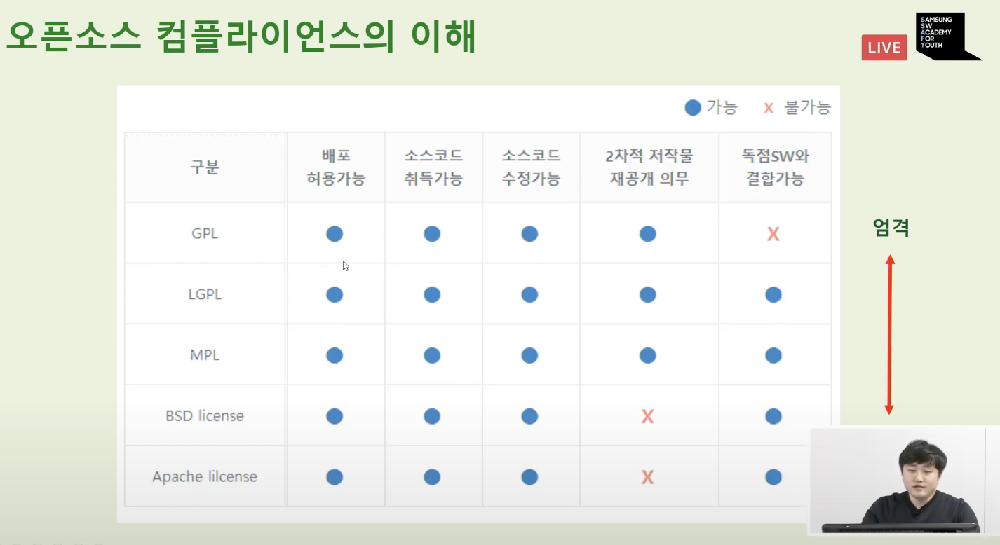

# Open Source Software

## 1부 박수홍 그룹장님

### 1. Open Source, is it new?

Open Source Initiative: http://opensource.org

---

< Open Source Definition >

1. Free Redistribution
2. Source Code
3. Derived Works
4. Integrity of The Author's Source Code
5. No Discrimination Against Persons or Groups
6. No Discrimination Against Fields of Endeavor
7. Distribution of License
8. License Must Not Be Specific to a Product
9. License Must Not Restrict Other Software
10. License Must Be Technology - Neutral

< 5 ways to make money with open source >

1. Sell Support Contracts
2. Sell Binaries
3. Sell Documentation
4. Sell Value-Added Enhancement
5. Sell Your Expertise as Consultant

### 2. Why Open Source

### 3. What Samsung is doing

https://opensource.samsung.com

< Key Value for Future Techs in Samsung >

1. OPENNESS

    - Source Code and Project Open
    - Communities Participation

2. Collaboration

    - Global Open Source Leading
    - Korean Association, Dev Program

3. Development Culture

    - Internal Infrastructure
    - Inner Source Program

    

### 4. Concluding Remarks

## 2부 고병권 프로님

### 1. 오픈 소스

- 열정 능력 성장

- 개발자들 신기술 개발 =(믿음 by 리차드 스톨만)=> SW 발전을 위해 공개
    - 어라 돈이 되겠네? => 재포장 & 판매 -> ok
        - 코드 접근 차단 & 불법 복제 고소 -> 화가 난 원 개발자들 => License

- "누군가가 나의 등잔의 심지에서 불을 붙여가도 내 등잔의 불은 여전히 빛나고 있습니다." - 토마스 제퍼슨 -
- Open Source Contribution

### 2. 오픈소스 기여가 우리에게 줄 수 있는 영향?

1. 회사 입사 전

    - 간접 경험을 통한 회사 생활에 대한 궁금증 해소

        > <개발 시스템>
        >
        > - Issue Tracker (PLM)
        > - 형상관리 툴(git, perforce)
        > - 코드 리뷰(gerrit, swarm)
        > - CI(jenkins)
        > - 개발(Documents, Comments, Tests)

    - 입사 지원시 특혜

        - 지원서에 ID 작성

        - 오픈소스 컨트리뷰터를 원하는 회사 많음

            ><컨트리뷰터의 장점>
            >
            >- 오픈소스의 이해
            >- 경력자(교육 비용, 시간 등)
            >- 퍼포먼스

            

2. 회사 입사 후

    - 회사 발전에 기여(Jumbo Build)
    - Technical Leading
    - 이직시 도움

    

3. 개발자로서

    - 전 세계인이 사용하는 SW 개발
    - 워너비 프로젝트
    - 실력 향상

### 3. 그럼 모두 오픈소스 기여를 시작하면 되잖아요?

<어려움>

- 진입 장벽
- 시간 부족
- 꾸준함

### 4. 회사원에서 오픈소스 개발자로 거듭나기

- 신입사원 => SCM(Supply Chain Management)

-  오픈소스 => 그냥 함

    > 행복의 비결은 포기해야 할 것을 포기하는 것이다. - 앤드류 카네기 - => 포기함

- 다른 직군의 스카웃 제의

    > 나를 돌아보게 된 시간
    >
    > - 스스로에 대한 고찰 -> 개발을 하고 있는 **회사원**
    > - 회사원이 아닌 **개발자**가 되기를 결심함

- 회사원, 개발자를 꿈꾸다 => 오픈소스

    < Chromium 오픈소스를 선택한 이유 >

    - ~~옆에서 꼬셔서~~ 경험이 있다.
    - ~~구글이 해서~~ 많은 사람들이 사용하는 SW
    - 다양한 분야를 경험할 수 있는 기회

- 꾸준함을 위한 노력
    1. 컨퍼런스 참여
    2. 강제성 (벌금) 도입
    3. 벼랑 끝으로 Move
- 앞으로 나는...
    - Speaking English
    - 체력 키우기
    - 오픈소스 프로젝트 만들기

## 3부 김인성 프로님
### 1. 오픈소스의 중요성

- 조사 기업 중 99%가 오픈소스는 기업에 중요하다고 답변함
- 자사 경쟁력 확보를 위해 69%가 오픈소스가 매우 중요하다고 응답함

=> 오픈소스 활동하여 인지도를 쌓는 것 자체가 기업이 원하는 인재가 되는 것!!

### 2. 오픈소스 정의

> ▵ 오픈소스는 FREE 소프트웨어이다 
>
> ◯ 오픈소스는 공개 소프트웨어이다

> 한마디로 정의하자면 오픈소스는 '무료로 공개된 코드 + 라이선스'임

- 소스코드가 무료로 공개되어 누구나 자유롭게 사용/수정/배포할 수 있는 S/W

- Open Source Initiative(opensource.org)

    오픈소스 라이선스의 기준을 정의하고 기준에 부합하는 라이선스에 대해서 오픈소스로 인증해주는 단체

- OSI(Open Source Initiative) 정의

    1. 자유롭게 배포할 수 있어야 함
    2. 소스코드가 제공되어야 하며 소스코드의 재배포도 허용해야 함
    3. 소스코드를 수정하여 파생 저작물을 만들 수 있어야 함
    4. 변경된 소프트웨어에는 다른 이름이나 버전을 부여함으로써 원저작자의 코드를 보장해야 함
    5. 특정인이나 특정 그룹에 대해서 차별이 없어야 함
    6. 특정 분야에 대해서 차별이 없어야 함
    7. 소스코드를 받는 사용자가 동일한 라이선스로 사용할 수 있어야 함
    8. 라이선스가 특정 제품에 국한되어서는 안됨
    9. 라이선스가 파생 저작물이 아닌 다른 소프트웨어를 제한해서는 안 됨
    10. 라이선스는 기술에 대해서 중립적이어야 함

- 오픈소스 라이선스: 상용 라이선스는 금전적 비용을 지불하고 "사용"의 의무사항만 준수하면 되지만, 오픈소스 라이선스는 무상으로 제공되는 대신 일정한 의무사항을 준수해야 함

    > - 오픈 소스 개발자(저작권자) -(사용, 복제, 배포, 수정의 자유)-> 오픈 소스 사용자(당사)
    >
    > - 오픈 소스 개발자(저작권자) <-(라이선스에 명시된 의무 사항 준수(위반시 저작권 침해에 해당함), 오픈소스 사용여부 고지, 소스코드 제공)- 오픈 소스 사용자(당사)

### 3. 오픈소스 개발 방식의 이해

<개발 방식>

< 구성원 >

- Owner Maintainer
- Core Developers
- Active Developers
- Members
- Users

### 4. 실제 오픈소스 활동하는 방법 

1. 관심 분야 선택하기

    > 내가 좋아하는 분야?, 요즘 핫한 분야?, 꾸준한 분야?, 향후 발전할 분야?

2. 관련 커뮤니티 or 프로젝트 찾기

    > 구글링, 오픈소스 행사 찾기, SOS Masters 프로그램 참여해보기

3. 관련 문서 파악하기

    > 프로젝트에서 제공하는 전문 웹 사이트 문서, Github에 Readme.md 파일

4. 사용해보기

    > 문서로 파악된 프로젝트를 실제로 코드를 받아서 사용

5. 기여해보기

    > - 깃허브 활용법 익히기
    > - 소스코드 내의 주석 오타 수정, 샘플코드 만들기, 문서 번역, 오타 수정 등
    > - 버그 수정, 기능 개발 등

### 5. SOS Masters 프로그램

1. masters: 커뮤니티에서 인정을 받은 오픈소스 전문가
2. Runner: 이슈를 직접 올려보고, 해결도 직접 해봄
3. Walker: 오픈소스에 Commit을 하고 PR을 해본 단계
4. Toddler: SOS Master를 통해 Github에 첫 commit 경험

### 6. 오픈소스 실습; Toddler 되기 

https://opensource.samsung.com/main

