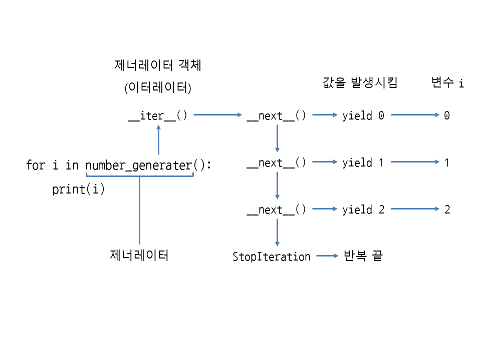
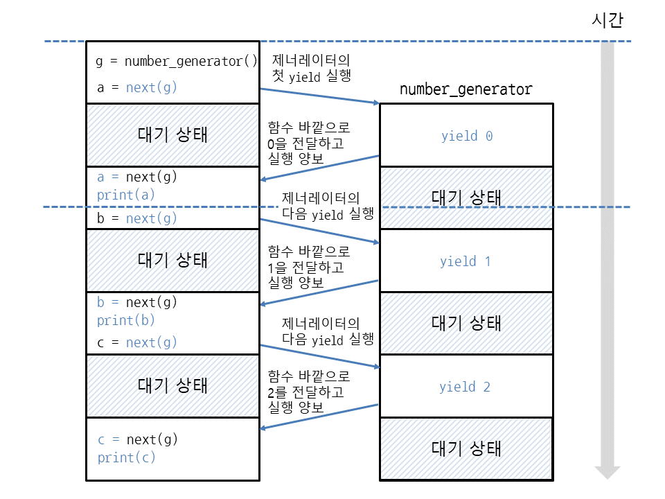
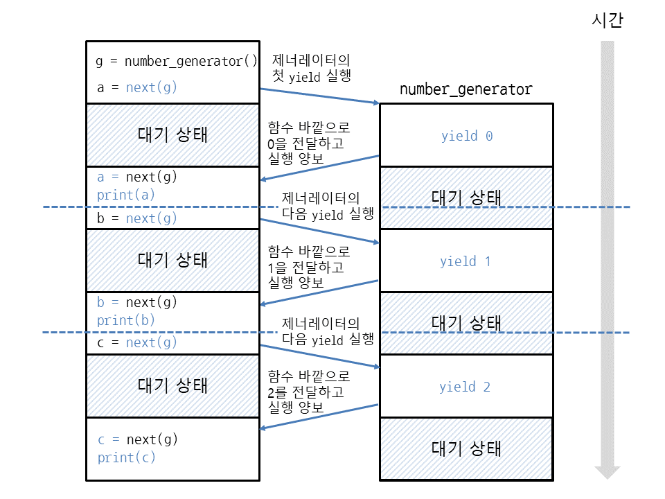

# 제너레이터와 yield 알아보기

- 제너레이터(발생자)

  - 이터레이터를 생성해주는 함수임 (그 반대는 성립안함)

    > 제너레이터는 이터레이터보다 훨씬 간단하게 작성할 수 있음

    |                 제너레이터                  |                          이터레이터                          |
    | :-----------------------------------------: | :----------------------------------------------------------: |
    | yield라는 키워드 사용하여 값(변수)을 지정함 | 클래스에 `__iter__`, `__next__` 또는 `__getitem__` 메서드를 구현해야 함 |

    

- 예

  ```python
  def number_generator():
      yield 0
      yield 1
      yield 2
      
  for i in number_generator():
      print(i)
  ```

  ```bash
  0
  1
  2
  ```


- 제너레이터 객체가 이터레이터인지 확인하기

  ```bash
  >>> g = number_generator()
  >>> g
  <generator object number_generator at 0x00000256B7A6AB30>
  >>> dir(g)
  ['__class__', '__del__', '__delattr__', '__dir__', '__doc__', '__eq__', '__format__', '__ge__', '__getattribute__', '__gt__', '__hash__', '__init__', '__init_subclass__', '__iter__', '__le__', '__lt__', '__name__', '__ne__', '__new__', '__next__', '__qualname__', '__reduce__', '__reduce_ex__', '__repr__', '__setattr__', '__sizeof__', '__str__', '__subclasshook__', 'close',
  'gi_code', 'gi_frame', 'gi_running', 'gi_yieldfrom', 'send', 'throw']
  ```

  - number_generator 함수를 호출하면 제너레이터 객체(generator object)가 반환됨
  - 이 객체를 dir 함수로 살펴보면 이터레이터에서 볼 수 있는 `__iter__`, `__next__` 메서드가 들어있음

  ```bash
  >>> g.__next__()
  0
  >>> g.__next__()
  1
  >>> g.__next__()
  2
  >> g.__next__()
  # StopIteration 예외 발생
  ```

  - 이터레이터는 `__next__` 메서드 안에서 직접 return으로 값을 반환했지만 제너레이터는 yield에 지정한 값이 `__next__` 메서드(next 함수)의 반환값으로 나옴
  - 이터레이터는 raise로 StopIteration 예외를 직접 발생시켰지만 제너레이터는 함수의 끝까지 도달하면 StopIteration 예외가 자동으로 발생함
  - 제너레이터는 제너레이터 객체에서 `__next__` 메서드를 호출할 때마다 함수 안의 yield까지 코드를 실행하며 yield에서 값을 발생시킴(generate)
  
  

- for와 제너레이터

  - 다음과 같이 for 반복문을 반복할 때마다 `__next__`를 호출하므로 yield에서 발생시킨 값을 가져옴

  

- yield의 동작 과정 알아보기

  그럼 yield의 동작 과정을 알아보기 위해 for 반복문 대신 next 함수로 __next__ 메서드를 직접 호출해보겠습니다.

    `변수 = next(제너레이터객체)`

  ```python
  def number_generator():
      yield 0    # 0을 함수 바깥으로 전달하면서 코드 실행을 함수 바깥에 양보
      yield 1    # 1을 함수 바깥으로 전달하면서 코드 실행을 함수 바깥에 양보
      yield 2    # 2를 함수 바깥으로 전달하면서 코드 실행을 함수 바깥에 양보
   
  g = number_generator()
   
  a = next(g)    # yield를 사용하여 함수 바깥으로 전달한 값은 next의 반환값으로 나옴
  print(a)       # 0
   
  b = next(g)
  print(b)       # 1
   
  c = next(g)
  print(c)       # 2
  ```

  ```bash
  0
  1
  2
  ```

  yield를 사용하여 바깥으로 전달한 값은 next 함수(__next__ 메서드)의 반환값으로 나온다고 했습니다. 따라서 next(g)의 반환값을 출력해보면 yield에 지정한 값 0, 1, 2가 차례대로 나옵니다. 즉, 제너레이터 함수가 실행되는 중간에 next로 값을 가져옵니다.

  next와 yield의 동작 과정을 그림으로 살펴보겠습니다.

  먼저 g = number_generator()와 같이 제너레이터 객체를 만듭니다. 그다음에 next(g)를 호출하면 제너레이터 안의 yield 0이 실행되어 숫자 0을 전달한 뒤 바깥의 코드가 실행되도록 양보합니다. 함수 바깥에서는 print(a)로 next(g)에서 반환된 값을 출력합니다.

    

  값을 출력했으면 next(g)로 다시 제너레이터 안의 코드를 실행합니다. 이때는 yield 1이 실행되고 숫자 1을 발생시켜서 바깥으로 전달합니다. 그리고 함수 바깥에서는 print(b)로 next(g)에서 반환된 값을 출력합니다.

    

  마찬가지로 과정으로 yield 2도 숫자를 발생시키고 print(c)로 제너레이터에서 나온 값을 출력합니다.

    

  이렇게 제너레이터는 함수를 끝내지 않은 상태에서 yield를 사용하여 값을 바깥으로 전달할 수 있습니다. 즉, return은 반환 즉시 함수가 끝나지만 yield는 잠시 함수 바깥의 코드가 실행되도록 양보하여 값을 가져가게 한 뒤 다시 제너레이터 안의 코드를 계속 실행하는 방식입니다. 


> 참고 | 제너레이터와 return

제너레이터는 함수 끝까지 도달하면 StopIteration 예외가 발생합니다. 마찬가지로 return도 함수를 끝내므로 return을 사용해서 함수 중간에 빠져나오면 StopIteration 예외가 발생합니다.

특히 제너레이터 안에서 return에 반환값을 지정하면 StopIteration 예외의 에러 메시지로 들어갑니다.

```python
def one_generator():
    yield 1
    return 'return에 지정한 값'
 
try:
    g = one_generator()
    next(g)
    next(g)
except StopIteration as e:
    print(e)    # return에 지정한 값
```

```bash
return에 지정한 값
```

